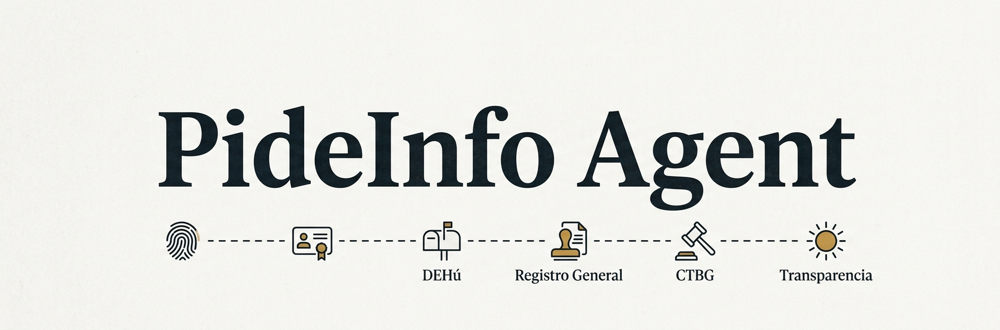
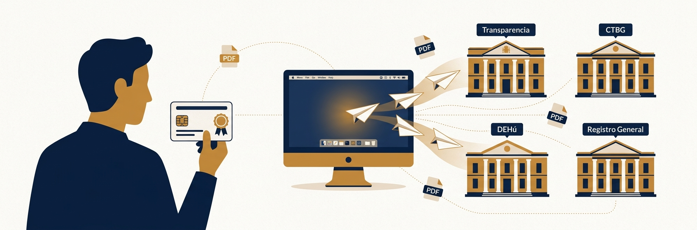

# PideInfo Agent

Aplicación de escritorio que actúa como puente entre PideInfo y los portales de la administración española:

- **Sincroniza** automáticamente el Portal de Transparencia (AGE), la sede electrónica del Consejo de Transparencia y Buen Gobierno (CTBG) y el buzón DEHú con el backend de PideInfo.
- **Presenta reclamaciones** ante el CTBG por orden del usuario: la web manda una tarea al agente vía `pideinfo://`, el agente conduce el wizard Wicket de la sede CTBG con Cl@ve y devuelve el acuse a PideInfo.
- **Registra documentación adicional** en RED SARA / Registro Electrónico General cuando el usuario lo solicita desde la web.

DEHú y RED SARA / Registro Electrónico General son **plataformas distintas** (aunque ambas se sirvan desde dominios `*.redsara.es`): DEHú es el buzón único de notificaciones electrónicas, mientras que RED SARA / Registro Electrónico General es el registro telemático para presentar escritos ante cualquier administración.

El agente se ejecuta en segundo plano como icono en la barra del sistema (macOS), en la bandeja del sistema (Windows) o como AppIndicator (Linux). Autentica al usuario mediante el sistema Cl@ve, mantiene sesiones por portal y se comunica con PideInfo vía HTTP+JWT.

---

## Índice

1. [Arquitectura general](#arquitectura-general)
2. [Estructura del proyecto](#estructura-del-proyecto)
3. [Flujos principales](#flujos-principales)
4. [Seguridad](#seguridad)
5. [Autenticación con los portales](#autenticación-con-los-portales)
6. [Ciclo de sincronización](#ciclo-de-sincronización)
7. [Integración con PideInfo](#integración-con-pideinfo)
8. [Interfaz de escritorio](#interfaz-de-escritorio)
9. [Configuración](#configuración)
10. [Empaquetado como aplicación de escritorio](#empaquetado-como-aplicación-de-escritorio)
11. [Actualización automática](#actualización-automática)
12. [CI/CD](#cicd)
13. [Requisitos e instalación en desarrollo](#requisitos-e-instalación-en-desarrollo)

---

## Arquitectura general

```
┌──────────────────────────────────────────────────────────────────────────────┐
│                              PideInfo Agent                                  │
│                                                                              │
│  ┌──────────┐  ┌──────────────┐  ┌──────────┐  ┌────────────────────────┐    │
│  │ Tray UI  │  │   main.py    │  │ protocol/│  │     APScheduler        │    │
│  │(pystray) │─▶│  CLI entry   │◀─│ pideinfo:│  │ (sync cada 30 min,     │    │
│  └──────────┘  └──────┬───────┘  │  ://     │  │  drain tareas cada 60s)│    │
│                       │          └──────────┘  └────────────┬───────────┘    │
│                       │                                     │                │
│           ┌───────────▼─────────────┐  ┌────────────────────▼────────────┐   │
│           │       do_sync()         │  │      tasks/ (dispatcher)        │   │
│           │  scrapers por portal    │  │  present_complaint, …           │   │
│           └────┬────────────────────┘  └────────────────┬────────────────┘   │
│                │                                        │                    │
│   ┌────────────▼───────────────┐  ┌────────────────────▼─────────────────┐   │
│   │       Portales              │  │ portals/ctbg_complaint_filler        │   │
│   │  TransparenciaAGE  CTBG     │  │ + auth/playwright_auth (Cl@ve)       │   │
│   │  DehuScraper    RedSARA-REG │  │   conduce el wizard Wicket de        │   │
│   │  Consejo expedientes        │  │   reclamaciones del CTBG             │   │
│   └────────────┬────────────────┘  └────────────────┬─────────────────────┘   │
│                │                                    │                         │
│   ┌────────────▼────────────────────────────────────▼─────────────────────┐   │
│   │                  PideInfoClient (httpx + JWT Bearer)                  │   │
│   │   POST /api/agent/webhook   ·   /api/agent/tasks/{id}/{progress,…}    │   │
│   └───────────────────────────────────────────────────────────────────────┘   │
│                                                                              │
│   observability.py  →  agent.log (rotativo)   +   Sentry (DSN baked-in)     │
└──────────────────────────────────────────────────────────────────────────────┘
       │                  │                  │                 │
       ▼                  ▼                  ▼                 ▼
 Portal Transparencia   CTBG sede           DEHú         RED SARA / Reg. Gral.
   transparencia       consejodetrans-    dehu.redsara    reg.redsara.es
   .sede.gob.es        parencia.gob.es      .es
```

El agente es **sin servidor**: no expone puertos, no tiene base de datos propia. Todo el estado persistente (cookies de sesión, documentos ya sincronizados, token JWT) se guarda localmente en `~/.pideinfo-agent/`.

---

## Estructura del proyecto

```
.
├── main.py                  # Entry CLI: arranca tray/daemon/sync único + IPC pideinfo://
├── tray.py                  # Bandeja del sistema (pystray + Pillow)
├── config.py                # Settings tipadas (pydantic-settings, .env)
├── version.py               # Fuente única de versión: __version__
├── runtime.py               # Frozen helpers + apply_baked_env() + ensure_firefox()
├── observability.py         # Logging rotativo a fichero + Sentry (DSN baked-in)
│
├── auth/
│   ├── playwright_auth.py        # Auth Cl@ve vía Firefox + perfil persistente
│   ├── session_manager.py        # Cookies del Portal de Transparencia
│   ├── dehu_auth.py              # Auth DEHú: Cl@ve + captura del Bearer JWT Angular
│   ├── dehu_session_manager.py   # Cookies + JWT DEHú (verifica `exp` localmente)
│   ├── redsara_auth.py           # Auth RED SARA / Registro Electrónico General vía Cl@ve
│   └── redsara_session_manager.py
│
├── portals/
│   ├── base.py              # Protocolo PortalScraper
│   ├── transparencia_age.py # Scraper Portal de Transparencia AGE
│   ├── consejo_ctbg.py      # Listado de buzón electrónico del CTBG (Wicket)
│   ├── consejo_expediente.py        # Detalle de expediente CTBG (BS4 + httpx)
│   ├── ctbg_complaint_filler.py     # Conduce el wizard Wicket de reclamaciones
│   ├── dehu_redsara.py      # Scraper DEHú (REST API JSON) — nota: el nombre del
│   │                        # fichero es histórico; la plataforma es solo DEHú
│   └── redsara_rec.py       # Cliente RED SARA / Registro Electrónico General
│
├── protocol/                # Recepción de URLs pideinfo:// del SO
│   ├── single_instance.py        # AF_UNIX / named pipe — relay si ya hay un agente
│   ├── url_handler.py            # Parser y router de pideinfo://action/<id>
│   ├── registration.py           # Registra el handler en Linux/Win/macOS
│   └── macos_url_events.py       # NSAppleEventManager para URLs en runtime
│
├── tasks/                   # Tareas que la web envía al agente
│   ├── __init__.py               # Dispatcher por tipo + report_exception
│   └── present_complaint.py      # Pipeline de reclamación CTBG end-to-end
│
├── client/
│   └── pideinfo.py          # Cliente httpx async/sync con JWT Bearer
│
├── models/                  # DTOs de portal y de notificaciones
├── storage/                 # state.json + preferences.json + downloads/
├── notifier/desktop.py      # Notificaciones del SO
├── ui/connect_dialog.py     # Diálogos Tk: conectar / configurar
├── updater/github_updater.py # Comprobación de releases v* en GitHub
│
├── build/
│   ├── pideinfo-agent.spec  # Spec PyInstaller (multiplataforma)
│   ├── hooks/               # Hooks playwright + truststore
│   ├── macos/               # entitlements.plist (firma + notarización)
│   ├── windows/             # installer.nsi (NSIS)
│   └── linux/               # .desktop + AppRun para AppImage
│
├── _baked_env.py            # Generado por CI: SENTRY_DSN_AGENT, SENTRY_ENVIRONMENT
│                            # (gitignored — ver `.github/workflows/build.yml`)
├── requirements.txt
├── pyproject.toml
└── .env.example
```

---

## Flujos principales

### 1. Inicio de la aplicación

```
main.py
  │
  ├─ apply_baked_env()               ← inyecta SENTRY_DSN_AGENT/SENTRY_ENVIRONMENT
  │                                    desde _baked_env.py si CI lo generó
  ├─ setup_playwright_env()          ← fija PLAYWRIGHT_BROWSERS_PATH antes de
  │                                    importar playwright en ningún módulo
  ├─ Settings(_env_file=...)         ← carga .env + variables de entorno
  ├─ observability.init(...)         ← logging rotativo a agent.log + Sentry
  ├─ acquire_or_relay(args.url, …)   ← single-instance vía AF_UNIX / named pipe
  │                                    (si hay otro agente vivo, le relaya el URL
  │                                     pideinfo:// y termina; en macOS también
  │                                     instala el handler kAEGetURL en runtime)
  ├─ ensure_firefox()                ← descarga Firefox si falta (~80 MB, 1ª vez)
  ├─ Despacha args.url + drena cola de tareas pendientes en /api/agent/tasks
  └─ modo de ejecución:
       --tray    → _run_tray()       ← abre icono en barra del sistema
       --daemon  → do_daemon()       ← sincronización periódica con APScheduler
       --once    → do_sync()         ← un solo ciclo de sincronización
       --auth-only → do_auth()       ← solo abre el navegador para autenticar
       --url <pideinfo://…>          ← se relaya al agente vivo (no spawn extra)
```

### 2. Flujo de autenticación con el portal

```
SessionManager.get_valid_session()
  │
  ├─ load_cookies()           ← lee metadata de disco, secretos del OS keyring
  │    └─ is_session_valid()  ← GET /privada/expedientes (no follow redirect)
  │         ├─ 200 OK  → sesión válida, continúa
  │         └─ redirect → sesión expirada
  │
  └─ (si no hay cookies válidas)
       playwright_auth.authenticate()
         │
         ├─ Comprueba si firefox-profile/prefs.js existe
         │    ├─ NO (1ª vez) → Firefox en modo headed (ventana visible)
         │    │                  El usuario elige su certificado en el selector de Firefox
         │    │                  → Firefox lo guarda en el perfil persistente
         │    └─ SÍ (usos posteriores) → Firefox en modo headless (sin ventana)
         │                  El certificado se selecciona automáticamente del perfil
         │                  El usuario no ve ni interactúa con nada
         ├─ security.osclientcerts.autoload: true
         │    ← Firefox carga los certs directamente del Keychain del SO
         │       sin extraer ni copiar la clave privada
         ├─ Navega a /claveproxy/clave/authenticate?returnUrl=...
         ├─ Auto-click en "DNIe / Certificado electrónico" (AFIRMA IdP)
         ├─ Espera hasta que el usuario complete la auth (timeout: 120 s)
         └─ Extrae cookies del contexto del navegador
              └─ save_cookies() → valores al OS keyring, timestamp a disco
```

### 3. Ciclo de sincronización completo

```
do_sync()
  │
  ├─ 1. Portal de Transparencia AGE ─────────────────────────────────────
  │    ├─ GET /privada/expedientes (paginado, 15/página)
  │    │    └─ Extrae JSON de <input id="expedientesData" type="hidden">
  │    ├─ GET /privada/notificaciones (paginado)
  │    │    └─ Extrae JSON de <input id="notificacionesData" type="hidden">
  │    │
  │    ├─ Para cada expediente (no AC1, no ACCEDA, no borrador):
  │    │    ├─ GET /privada/expediente?id=N
  │    │    ├─ Extrae documentos de <input id="documentosData">
  │    │    ├─ Filtra los no sincronizados (state.is_document_synced)
  │    │    ├─ Descarga todos a ~/.pideinfo-agent/downloads/
  │    │    └─ POST /api/agent/webhook (batch, SOLICITUD primero)
  │    │         └─ Documentos en base64 + SHA-256 + metadatos del expediente
  │    │
  │    ├─ Para cada notificación descargable (FIRMADA, LEIDA, EXPIRADA):
  │    │    ├─ Descarga el documento
  │    │    └─ POST /api/agent/webhook (individual + metadatos de notificación)
  │    │
  │    └─ Reporta notificaciones PENDIENTE a PideInfo (sin descargar)
  │         └─ POST con pendingNotifications[] para que PideInfo las muestre al usuario
  │
  ├─ 2. Guarda estado (state.json) ─────────────────────────────────────
  │
  ├─ 3. CTBG (Consejo de Transparencia) ────────────────────────────────
  │    ├─ Sesión independiente con cookies propias
  │    ├─ GET /enotifications.9 (Wicket framework, tabla HTML)
  │    ├─ BeautifulSoup parsea ElectronicMailboxListPanel
  │    └─ Reporta pendientes a PideInfo vía webhook (source: consejo_ctbg)
  │
  ├─ 4. DEHú ────────────────────────────────────────────────────────────
  │    ├─ DehuSessionManager comprueba expiración del JWT en local
  │    │    (decodifica base64 el payload, lee claim exp — sin red)
  │    │    ├─ JWT válido → reutiliza cookies + JWT del keyring
  │    │    └─ JWT expirado/ausente → re-auth Firefox (headless si perfil ya existe)
  │    │         └─ context.on("request") captura Bearer JWT del primer XHR Angular
  │    ├─ GET /api/v1/notifications (httpx + Authorization: Bearer <jwt>)
  │    └─ Reporta notificaciones pendientes a PideInfo (source: dehu_redsara)
  │
  └─ 5. RED SARA / Registro Electrónico General ─────────────────────────
       ├─ Sesión independiente Cl@ve (cookies_redsara.json + keyring)
       └─ Sólo se invoca bajo demanda desde una tarea pideinfo:// (no se
          incluye en el ciclo periódico — el Registro no tiene buzón que
          pollear, sólo se usa para presentar escritos)
```

### 4. Recepción de tareas pideinfo://

La web puede pedirle al agente que **ejecute** algo (presentar una reclamación, registrar documentación en el REC, …) abriendo un URL `pideinfo://<action>/<task_id>`. El SO lo enruta al agente, que lo despacha al handler correspondiente.

```
Usuario clica "Presentar reclamación" en pideinfo.es
  │
  ▼
Navegador → pideinfo://present-complaint/<task_id>
  │
  ▼
SO entrega el URL al .app/.exe registrado:
  Linux   → xdg-mime → .desktop → pideinfo-agent --url …
  Windows → HKCU\Software\Classes\pideinfo → "%1"
  macOS   → Launch Services → CFBundleURLTypes → kAEGetURL
  │
  ▼
protocol/single_instance.acquire_or_relay()
  ├─ Si NO hay agente vivo  → se convierte en primario y dispatch local
  └─ Si hay agente vivo     → relaya por AF_UNIX/named pipe; en macOS se
                              entrega además vía NSAppleEventManager
  │
  ▼
tasks/dispatch_action_id(action, task_id, client)
  ├─ POST /api/agent/tasks/{id}/claim   ← reserva la tarea (idempotente)
  ├─ Resuelve el handler por task["type"] (ej. "present_complaint")
  ├─ El handler envía progress_task() periódicamente
  └─ complete_task(success=True|False, error=…, result={…})
       ├─ Excepciones → logger.exception() + observability.capture_exception()
       └─ Tags: task_id, task_type, mode → enriquecen el evento Sentry
```

Tipos de tarea soportados (`tasks/__init__.py`):

| `task["type"]` | Handler | Qué hace |
|---|---|---|
| `present_complaint` | `tasks/present_complaint.py` | Conduce el wizard Wicket de reclamaciones del CTBG (`portals/ctbg_complaint_filler.py`), sube los PDFs descargados de PideInfo (`/api/agent/documents/{id}/download`) y devuelve registro/CSV. |

Las tareas que llegaron mientras el agente estaba apagado se **drenan al arrancar** (`GET /api/agent/tasks/pending`) y, mientras corre, un job de APScheduler las pollea cada 60 s desde el tray.

Tanto la sincronización periódica de portales como el drenado de tareas se **omiten silenciosamente mientras el agente no esté conectado** (sin JWT en el keyring): no tendría a quién mandar los documentos ni las tareas, y abrir los navegadores de Cl@ve antes de que el usuario haya pegado su token sólo serviría para asustar. El icono permanece visible para que pueda usar "Conectar".

### 5. Deduplicación de documentos

El estado de sincronización se persiste en `~/.pideinfo-agent/sync_state.json`:

```json
{
  "synced_documents": ["12345:67890", "12345:67891"],
  "synced_notification_ids": [111, 222],
  "pending_notification_expediente_ids": ["12345"],
  "ctbg_pending_expediente_refs": ["2026-EXP-001"],
  "dehu_pending_sent_references": ["9e177342ba..."],
  "last_sync": "2026-03-31T10:00:00"
}
```

La clave de deduplicación es `{id_expediente}:{id_documento}`. Un documento nunca se descarga ni envía dos veces, incluso si el agente se interrumpe a mitad de un ciclo.

---

## Seguridad

### Almacenamiento de credenciales

| Dato | Dónde se almacena |
|---|---|
| Token JWT de PideInfo | **OS keyring** (`pideinfo-agent / pideinfo:jwt`) |
| Cookies de sesión — portal principal | **OS keyring** (`pideinfo-agent / cookies:cookies`) |
| Cookies de sesión — CTBG | **OS keyring** (`pideinfo-agent / cookies:cookies_ctbg`) |
| Cookies de sesión — DEHú | **OS keyring** (`pideinfo-agent / cookies:cookies_dehu`) |
| JWT Bearer de DEHú | **OS keyring** (`pideinfo-agent / dehu:jwt`) |
| Metadatos no sensibles (email, URL, timestamps) | `~/.pideinfo-agent/preferences.json` (permisos 600) |

Ningún secreto se escribe en disco. Las instalaciones antiguas que tengan `jwt_token` en `preferences.json` lo migran automáticamente al keyring la primera vez que el agente arranca.

El agente **no almacena ningún fichero de certificado**. Los certificados residen únicamente en el almacén de certificados del sistema operativo (macOS Keychain, Windows Certificate Store, NSS en Linux), donde los instala el propio usuario o el instalador de la FNMT/CERES. El directorio `~/.pideinfo-agent/` tiene permisos `0700`.

### Autenticación con certificado: decisión de diseño

El sistema Cl@ve requiere un **certificado de cliente** (DNIe o FNMT/CERES) para autenticar al ciudadano. A continuación se documenta la evolución hasta la solución actual.

#### Intento 1 — Chromium con `--auto-select-client-certificates`

La primera versión lanzaba Chromium (el navegador empaquetado por Playwright) con el flag `--auto-select-client-certificates`. Este flag suprime el diálogo solo cuando **exactamente un** certificado coincide con el origen. En la práctica, los usuarios españoles suelen tener instalados varios certificados (p. ej. un certificado FNMT y uno del DNIe), por lo que el diálogo seguía apareciendo en cada autenticación.

#### Intento 2 — Política `AutoSelectCertificateForUrls`

Chrome permite configurar la selección automática de certificados por origen mediante la política `AutoSelectCertificateForUrls`, que admite filtros por emisor o número de serie. Sin embargo, Playwright deshabilita explícitamente la carga de políticas de empresa en su Chromium por razones de aislamiento y reproducibilidad ([issue #32324](https://github.com/microsoft/playwright/issues/32324)). Los intentos de inyectarla vía `defaults write`, ficheros JSON en el directorio de políticas o `chromeOptions.localState` no tuvieron efecto.

#### Intento 3 — Exportar el certificado del Keychain

Otra alternativa era leer el certificado del Keychain de macOS mediante PyObjC (`SecItemExport`) y pasarlo a la API `clientCertificates` de Playwright, que sí funciona con Chromium. Esta opción se descartó porque implica extraer la clave privada del Keychain —aunque fuera en memoria y sin escribir nunca a disco— lo que va en contra del principio de mínima exposición de la clave privada.

#### Solución final — Firefox con perfil persistente

Firefox implementa la preferencia `security.osclientcerts.autoload` que le indica que cargue los certificados directamente desde el almacén de certificados del sistema operativo (macOS Keychain, Windows Certificate Store). A diferencia de exportar el certificado, **la clave privada nunca sale del Keychain**: Firefox delega las operaciones criptográficas TLS en la API del sistema, exactamente igual que lo haría cualquier otro navegador nativo.

Combinado con un **perfil persistente** (`launch_persistent_context`), Firefox recuerda qué certificado eligió el usuario en cada origen. El resultado es:

- **Primera autenticación**: Firefox abre una ventana visible. El usuario elige su certificado FNMT o DNIe una sola vez en el selector nativo de Firefox.
- **Autenticaciones posteriores**: Firefox se lanza en modo **headless** (sin ventana). El certificado se selecciona automáticamente del perfil guardado; el usuario no ve ni interactúa con nada.

La decisión entre headed/headless se toma comprobando si `firefox-profile/prefs.js` existe en disco antes de lanzar el navegador.

```python
context = await p.firefox.launch_persistent_context(
    user_data_dir=str(firefox_profile_dir),   # recuerda la elección entre sesiones
    firefox_user_prefs={
        "security.osclientcerts.autoload": True,  # usa certs del Keychain del SO
    },
)
```

El perfil de Firefox se guarda en `~/.pideinfo-agent/firefox-profile/`. Contiene únicamente la preferencia de certificado por origen (un hash SHA-1), no la clave privada ni ningún secreto exportable.

### Comunicación de red

- Todas las peticiones al portal usan **HTTPS**.
- `truststore.inject_into_ssl()` configura Python para usar el almacén de certificados del sistema operativo, lo que permite verificar los certificados de las CAs del gobierno español (FNMT, etc.) sin necesidad de añadirlos manualmente.
- Las peticiones al portal se realizan con `ignore_https_errors: True` solo en el contexto de Playwright (necesario para los IdP del sistema Cl@ve), no en las peticiones httpx post-autenticación.
- El webhook de PideInfo se autentica con un **Bearer token JWT** en cada petición.

### Superficie de ataque

- El agente **no expone ningún puerto de red**.
- No tiene acceso a información de otras solicitudes de otros usuarios (el token JWT acota el acceso al usuario autenticado).
- Los documentos descargados se almacenan en `~/.pideinfo-agent/downloads/` y se borran inmediatamente después de enviarlos al webhook.

### Observabilidad

- **Local**: `agent.log` rotativo (5 MB × 3) en `DATA_DIR`, capturando todos los `getLogger(__name__)` del agente.
- **Sentry**: si el build tiene `SENTRY_DSN_AGENT` baked-in, los crashes y `logger.exception(...)` viajan a Sentry. El SDK aplica `before_send` para borrar `Authorization: Bearer …` y JWTs en URLs antes de enviar. El usuario puede desactivar la telemetría desde el menú del tray.
- **Pre-auth**: `observability.init()` se llama antes de `acquire_or_relay`, así los crashes de bootstrap (Firefox missing, registro de URL handler, single-instance) llegan a Sentry — la clase de error que históricamente se perdía porque nadie estaba mirando los logs.

---

## Autenticación con los portales



### Portal de Transparencia AGE

El portal usa el sistema **Cl@ve** de la Administración General del Estado como IdP. No existe una API pública; la autenticación es completamente browser-based:

1. El agente abre Firefox en modo headful (ventana visible), con un perfil persistente.
2. Navega a `/claveproxy/clave/authenticate?returnUrl=...` que redirige al IdP de Cl@ve.
3. Hace clic automático en el botón "DNIe / Certificado electrónico" (AFIRMA).
4. **Primera vez**: Firefox muestra su selector de certificado con los certificados del Keychain del sistema. El usuario elige el suyo.
5. **Siguientes veces**: Firefox selecciona el certificado automáticamente desde el perfil guardado.
6. El usuario completa la autenticación (PIN del certificado si el Keychain lo requiere).
7. Tras la redirección de vuelta al portal, se extraen las cookies de sesión.

Las cookies tienen una vida útil de varias horas. El agente las reutiliza en las siguientes sincronizaciones y solo vuelve a abrir el navegador cuando expiran.

### CTBG (Consejo de Transparencia)

La sede del CTBG usa el mismo sistema Cl@ve pero con un flujo ligeramente diferente (framework Wicket). El agente mantiene una **segunda sesión independiente** con su propio fichero de cookies (`cookies_ctbg.json`), ya que las cookies del portal principal no son válidas aquí.

### DEHú

DEHú (Dirección Electrónica Habilitada Única) es el buzón único de notificaciones electrónicas del Estado. Aunque se sirve desde `dehu.redsara.es` y comparte la infraestructura RED SARA con otros servicios, **es una plataforma distinta** del Registro Electrónico General: aquí sólo se reciben notificaciones, no se presentan escritos.

DEHú expone una **REST API JSON** en lugar de páginas HTML. Pero añade un requisito: además de las cookies de sesión, cada petición a la API requiere un **Bearer JWT** de corta duración (~10 minutos) que emite la aplicación Angular en el frontend.

El agente captura este JWT interceptando las peticiones de red del propio navegador durante la autenticación:

```
authenticate_dehu()
  │
  ├─ context.on("request", listener)   ← escucha ANTES de navegar
  ├─ Auth Cl@ve (mismo flujo Firefox + perfil persistente)
  ├─ Navega a /es/notifications         ← Angular dispara GET /api/v1/notifications
  │    └─ listener captura el header Authorization: Bearer <jwt>
  └─ Devuelve (cookies, jwt)
```

El JWT se guarda en el keyring (`dehu:jwt`). Antes de cada sincronización, `DehuSessionManager` decodifica el payload en local (sin red) para comprobar el claim `exp`. Si ha expirado, lanza una re-autenticación headless completa.

---

## Ciclo de sincronización

### Prioridad de documentos

Dentro del webhook por expediente, los documentos se envían con la **SOLICITUD primero**. Esto es intencional: el backend de PideInfo analiza el primer documento del lote para crear el `AccessRequest` si no existe todavía, usando la referencia del expediente como identificador.

### Tipos de notificación

| Estado | ¿Se descarga? | ¿Se reporta como pendiente? |
|---|---|---|
| FIRMADA | Sí | No |
| LEIDA | Sí | No |
| EXPIRADA (Resolución) | Sí | No |
| PENDIENTE | Solo si `accept_notifications` está activo | Sí (siempre) |
| RECHAZADA | No | No |

### Limpieza de pendientes

Cuando un expediente que tenía notificaciones PENDIENTE ya no las tiene (el usuario las firmó o caducaron), el agente envía un webhook con `pendingNotifications: []` para que PideInfo elimine la alerta en su interfaz.

---

## Integración con PideInfo

Todos los documentos se envían a `POST /api/agent/webhook` con el siguiente esquema:

```json
{
  "source": "transparencia_age",
  "expedienteRef": "2026-EXP-001234",
  "documents": [
    {
      "filename": "SOLICITUD - 2026-EXP-001234.pdf",
      "contentType": "application/pdf",
      "content": "<base64>",
      "contentHash": "<sha256-hex>",
      "portalDate": "2026-01-15"
    }
  ],
  "metadata": { ... },
  "pendingNotifications": [ ... ]
}
```

El campo `contentHash` (SHA-256) permite al backend de PideInfo detectar duplicados sin necesidad de reenviar el contenido. El agente también mantiene su propia deduplicación local para evitar descargas innecesarias.

---

## Interfaz de escritorio

El agente usa **pystray** para el icono en la barra del sistema y **Pillow** para renderizar el icono. La interfaz es mínima por diseño: el agente no tiene ventana principal.

### Menú (estado conectado)

```
Sincronizar ahora
Comprobar tareas pendientes              ← drena /api/agent/tasks bajo demanda
Resetear
────────────────
Aceptar notificaciones electrónicas  [✓/☐]
Sincronizar Portal de Transparencia  [✓/☐]
Sincronizar CTBG                     [✓/☐]
Sincronizar DEHú                     [✓/☐]
Sincronizar Red SARA REC             [✓/☐]   ← RED SARA / Registro Electrónico General
────────────────
Configurar...                            ← URL de PideInfo (override del .env)
Handler pideinfo:// registrado           ← o "Registrar handler de pideinfo://"
Desconectar
Conectado como usuario@ejemplo.com
────────────────
Actualizar a v1.2.0...                   ← solo si hay actualización disponible
────────────────
Deshabilitar headless                [✓/☐] ← fuerza ventana de Firefox visible
Enviar telemetría de errores         [✓/☐] ← opt-out de Sentry
PideInfo Agent v0.1.0                    ← versión actual (deshabilitado)
Cerrar
```

La autenticación con PideInfo es por **JWT**, no por certificado: el menú "Conectar" abre un diálogo que recibe un token generado en pideinfo.es. El certificado de Cl@ve sólo se usa contra los portales (Firefox + Keychain del SO).

### Indicador de actividad

El icono cambia de color durante la sincronización:
- **Azul** (`#1D4ED8`) — en reposo
- **Ámbar** (`#F59E0B`) — sincronizando

### Modelo de concurrencia

El bucle asyncio vive en un **hilo daemon en segundo plano**. El hilo principal pertenece a pystray (obligatorio en macOS, que requiere que el runloop de Cocoa esté en el hilo principal). Los callbacks del menú envían corrutinas al bucle mediante `asyncio.run_coroutine_threadsafe()`.

En macOS, antes de iniciar el runloop de pystray, el agente configura `NSApplicationActivationPolicyAccessory` para que no aparezca en el Dock ni en Mission Control.

---

## Configuración

Todas las variables se leen de un fichero `.env` (por defecto `.env` en el directorio de trabajo) y pueden sobreescribirse con variables de entorno:

| Variable | Valor por defecto | Descripción |
|---|---|---|
| `PORTAL_URL` | `https://transparencia.sede.gob.es` | URL del Portal de Transparencia AGE |
| `PORTAL_CTBG` | `https://sede.consejodetransparencia.gob.es/info.0` | URL de la sede del CTBG |
| `PORTAL_DEHU` | `https://dehu.redsara.es` | URL del buzón único de notificaciones DEHú |
| `PORTAL_REDSARA` | `https://reg.redsara.es` | URL de RED SARA / Registro Electrónico General |
| `PIDEINFO_BASE_URL` | `http://localhost:8000` | URL base del backend de PideInfo |
| `AUTH_TIMEOUT_SECONDS` | `120` | Segundos de espera para que el usuario complete la auth |
| `SYNC_INTERVAL_MINUTES` | `30` | Intervalo entre sincronizaciones en modo daemon |
| `DATA_DIR` | `~/.pideinfo-agent` | Directorio de datos del agente |
| `HEADLESS_DISABLED` | `false` | Fuerza Firefox en modo visible para todos los flujos (debug). El tray puede activarlo en runtime; el valor efectivo es la OR de las dos fuentes. |
| `CTBG_FULL_CRAWL` | `false` | Si `true`, recorre todos los expedientes del CTBG aunque estén cerrados; por defecto se detiene en el primer batch totalmente cerrado. |
| `SENTRY_DSN_AGENT` | *(vacío)* | DSN del proyecto Sentry **del agente** (distinto del de la web). Vacío = telemetría off. |
| `SENTRY_ENVIRONMENT` | `production` | Tag `environment` en los eventos Sentry (`production` para releases, `development` en CI manual). |
| `DEBUG` | `false` | Verbose logging del flujo del agente. |
### Datos persistentes en `DATA_DIR`

| Fichero | Contenido |
|---|---|
| `preferences.json` | Email/nombre del usuario, toggles de sincronización por portal, `telemetry_enabled`, `headless_disabled`. El JWT vive en el OS keyring, no en este fichero. |
| `cookies.json` | Timestamp de las cookies del Portal de Transparencia (valores en keyring) |
| `cookies_ctbg.json` | Timestamp de las cookies del CTBG (valores en keyring) |
| `cookies_dehu.json` | Timestamp de las cookies + JWT de DEHú (valores en keyring) |
| `cookies_redsara.json` | Timestamp de las cookies de RED SARA / Registro Electrónico General (valores en keyring) |
| `sync_state.json` | IDs de documentos ya sincronizados, pendientes por portal |
| `firefox-profile/` | Perfil persistente de Firefox: preferencias de certificado por origen |
| `downloads/` | Directorio temporal para documentos en tránsito |
| `agent.log` | Log rotativo (5 MB × 3 ficheros) — todos los `getLogger()` del agente |

---

## Empaquetado como aplicación de escritorio

El agente se distribuye como aplicación nativa mediante **PyInstaller** en modo `--onedir`.

### Decisiones de empaquetado

**Por qué PyInstaller y no Nuitka/Briefcase/cx_Freeze:**
Playwright lanza su propio proceso Node.js como subproceso. PyInstaller preserva la estructura de directorios necesaria para que `compute_driver_executable()` encuentre el binario `node` y `cli.js`. Nuitka compilaría Python a C pero rompería las rutas del subproceso de Playwright.

**Por qué `--onedir` y no `--onefile`:**
`--onefile` extrae todo a un directorio temporal al arrancar. Los paths de subprocesos (especialmente el driver de Playwright) se vuelven impredecibles. Con `--onedir` la estructura es estable y los paths son conocidos.

**Por qué Firefox no está empaquetado:**
El driver de Playwright (Node.js + `cli.js`) pesa ~124 MB y debe incluirse para que el agente funcione. Firefox pesa ~80 MB adicionales. En su lugar, Firefox se descarga en el primer arranque mediante `ensure_firefox()` y se guarda en un directorio persistente específico de la plataforma:

| Plataforma | Directorio de Firefox |
|---|---|
| macOS | `~/Library/Application Support/PideInfo Agent/playwright-browsers/` |
| Windows | `%LOCALAPPDATA%\PideInfo Agent\playwright-browsers\` |
| Linux | `~/.local/share/pideinfo-agent/playwright-browsers/` |

### Artefactos de distribución

| Plataforma | Formato | Tamaño aproximado |
|---|---|---|
| macOS arm64 | `.dmg` | ~130 MB |
| macOS x64 | `.dmg` | ~130 MB |
| Windows x64 | instalador NSIS `.exe` | ~125 MB |
| Linux x64 | `.AppImage` | ~125 MB |

La primera vez que se ejecuta, el agente descarga Firefox (~80 MB). Las siguientes veces arranca directamente.

### Construir manualmente

```bash
cd agent
pip install pyinstaller
pyinstaller build/pideinfo-agent.spec --distpath dist --workpath build/work
```

El artefacto queda en `dist/PideInfo Agent/` (o `dist/PideInfo Agent.app` en macOS).

---

## Actualización automática

El módulo `updater/github_updater.py` comprueba las GitHub Releases del repositorio buscando tags con el prefijo `v` (formato semver estándar: `v1.2.3`).

### Flujo de actualización

```
Al arrancar en modo --tray:
  │
  ├─ check_for_update()
  │    └─ GET https://api.github.com/repos/Naroh091/PideInfo-Agent/releases?per_page=20
  │    └─ Filtra tags v*, compara con __version__ usando packaging.version
  │    └─ Si hay versión mayor → guarda (version, download_url) en memoria
  │
  ├─ Si hay actualización:
  │    ├─ Añade "Actualizar a vX.Y.Z..." al menú del tray
  │    └─ Notificación de escritorio al usuario
  │
  └─ APScheduler repite la comprobación cada 6 horas

Al hacer clic en "Actualizar a vX.Y.Z...":
  │
  ├─ download_update() → descarga el asset de la plataforma a un fichero temporal
  │    macOS    → PideInfo-Agent-macos-arm64.dmg / macos-x64.dmg
  │    Windows  → PideInfo-Agent-windows-x64-setup.exe
  │    Linux    → PideInfo-Agent-linux-x64.AppImage
  │
  └─ apply_update()
       macOS   → open <fichero.dmg>  (el usuario arrastra la nueva .app)
       Windows → ejecuta el instalador .exe y sale
       Linux   → hace el AppImage ejecutable, muestra instrucciones y sale
```

---

## CI/CD

Dos workflows cooperan para entregar releases:

- **`.github/workflows/build.yml`** — se ejecuta en cada push y PR a `master` (CI), en tags `v*` (release), y manualmente. Construye los binarios para las tres plataformas.
- **`.github/workflows/release-please.yml`** — se ejecuta en cada push a `master`. [release-please](https://github.com/googleapis/release-please) acumula los commits desde el último tag, decide el bump semver según [Conventional Commits](https://www.conventionalcommits.org/) y abre/actualiza una **PR de release** con `version.py` + `pyproject.toml` bumpeados y `CHANGELOG.md` regenerado.

### Matriz de build

| Runner | Plataforma | Artefacto |
|---|---|---|
| `macos-14` | Apple Silicon (Intel vía Rosetta 2) | `PideInfo-Agent-macos-arm64.dmg` |
| `windows-latest` | x64 | `PideInfo-Agent-windows-x64-setup.exe` |
| `ubuntu-22.04` | x64 | `PideInfo-Agent-linux-x64.AppImage` |

### Pasos por plataforma

1. Instala Python 3.11 y dependencias del proyecto
2. Instala PyInstaller
3. **Bake Sentry config**: el step escribe `_baked_env.py` con `SENTRY_DSN_AGENT` (secreto de GitHub) y `SENTRY_ENVIRONMENT` (`production` para tags `v*`, `development` en CI / PR / `workflow_dispatch`).
4. Ejecuta `pyinstaller build/pideinfo-agent.spec`
5. **macOS**: crea DMG con `hdiutil`; firma con `codesign` si hay certificado disponible; notariza con `xcrun notarytool` si hay credenciales de Apple
6. **Windows**: empaqueta con NSIS usando `installer.nsi`
7. **Linux**: construye AppDir y empaqueta con `appimagetool`
8. En tag `v*`: descarga los artefactos y los adjunta a la Release que creó release-please (`gh release upload --clobber`).

### Cómo se publica una release

El versionado es **automático** según semver, derivado de los mensajes de commit (Conventional Commits):

| Commit | Bump |
|---|---|
| `fix: ...` | patch (`0.1.0` → `0.1.1`) |
| `feat: ...` | minor (`0.1.0` → `0.2.0`) |
| `feat!: ...` o `BREAKING CHANGE:` en el cuerpo | major (`0.1.0` → `1.0.0`) |
| `chore:`, `docs:`, `ci:`, `refactor:`, `test:` | sin bump |

Flujo end-to-end:

1. Mergeas commits en `master`.
2. release-please abre/actualiza una PR titulada `chore(master): release X.Y.Z` con el bump y el changelog.
3. Cuando quieras publicar, mergeas esa PR.
4. release-please crea el tag `vX.Y.Z` y la GitHub Release (vacía).
5. `build.yml` se dispara con el tag, construye los binarios y los adjunta a la Release.

---

## Requisitos e instalación en desarrollo

**Python 3.11+** es obligatorio (el proyecto usa `match`, `tomllib` y otras características modernas).

```bash
# Crear entorno virtual
python3.11 -m venv .venv
source .venv/bin/activate      # Windows: .venv\Scripts\activate

# Instalar dependencias
pip install -r requirements.txt

# Instalar el driver de Playwright y descargar Firefox
playwright install firefox

# Copiar y ajustar configuración
cp .env.example .env
# Editar .env con la URL de tu instancia de PideInfo y, opcionalmente,
# SENTRY_DSN_AGENT para que los crashes lleguen a Sentry también en dev.

# Ejecutar una sincronización de prueba (sin enviar a PideInfo)
python main.py --dry-run

# Ejecutar como bandeja del sistema
python main.py --tray
```

### Dependencias principales

| Paquete | Versión | Uso |
|---|---|---|
| `playwright` | ≥1.40 | Autenticación headful con Cl@ve (Firefox, perfil persistente) |
| `httpx` | ≥0.27 | Peticiones HTTP asíncronas al portal y a PideInfo |
| `pydantic-settings` | ≥2.0 | Configuración tipada desde `.env` |
| `apscheduler` | ≥3.10,<4 | Sincronización periódica en modo daemon/tray |
| `keyring` | ≥25.0 | Almacenamiento seguro de cookies y passphrases |
| `pystray` | ≥0.19 | Icono en la barra del sistema |
| `Pillow` | ≥10.0 | Renderizado del icono del tray |
| `truststore` | ≥0.9 | Certificados raíz del sistema para CAs del gobierno |
| `beautifulsoup4` | ≥4.12 | Parseo HTML del CTBG (Wicket) |
| `rich` | ≥13.0 | Salida de consola con formato |
| `packaging` | ≥24.0 | Comparación semver para el auto-updater |
| `pyobjc-*` | ≥9.2 | Integración con macOS (solo en macOS) — incluye `NSAppleEventManager` para URLs `pideinfo://` en runtime |
| `sentry-sdk` | ≥2.0 | Telemetría de errores (DSN baked-in en el build) |
